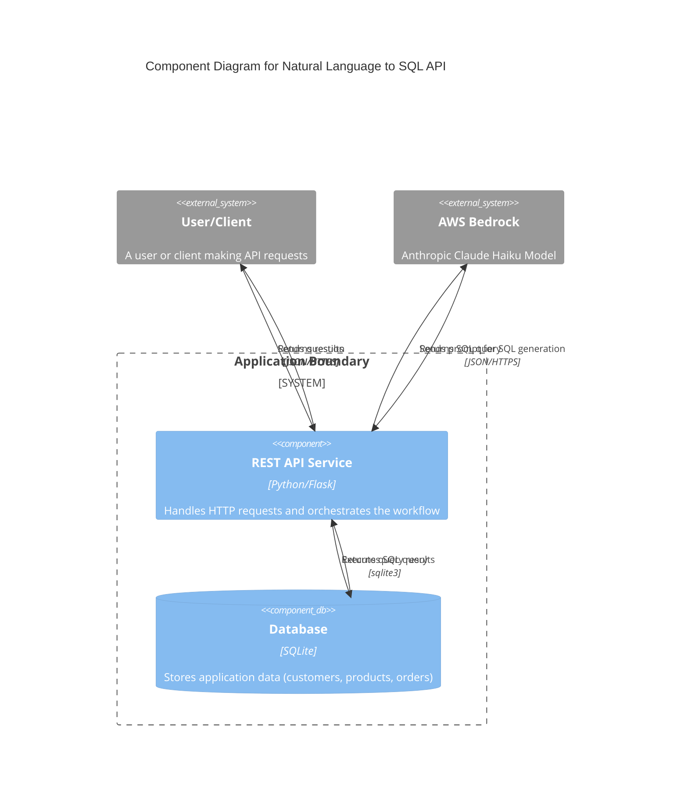

# Software Architecture Document: Natural Language to SQL REST API

**Note:** This document was automatically derived (reverse-engineered) using AI based on the app's codebase.

## 1. Architectural Style

The application follows a **Monolithic Architecture**.

**Justification:**
The entire application is contained within a single service (`restapi_service.py`). This single process is responsible for handling HTTP requests, invoking the AI model, and querying the database. All features are bundled into a single deployable unit, which is characteristic of a monolithic design. It also fits the **Client-Server** model, where the Flask application acts as the server responding to requests from HTTP clients.

## 2. Component Breakdown

*   **REST API Service:**
    *   **Responsibility:** A Flask-based web server that exposes a `/query` endpoint. It orchestrates the entire process, from receiving the user's question to returning the final database results.
*   **AI Service Client (Bedrock Client):**
    *   **Responsibility:** Encapsulated within the `invoke_model` function, this component is responsible for constructing the prompt and communicating with the external AWS Bedrock service to translate a natural language question into a SQL query.
*   **SQLite Database:**
    *   **Responsibility:** A local file-based database (`orders.db`) that provides persistent storage for the application's data (customers, products, orders). It is queried by the REST API service.
*   **Database Initialization Script:**
    *   **Responsibility:** A standalone script (`create_db.py`) used to create the `orders.db` file, define the schema, and populate it with initial sample data. This is a setup tool, not a runtime component.

## 3. Component Interaction Diagram (Mermaid)

## 4. Technology Stack

*   **Backend:** Python, Flask
*   **Database:** SQLite
*   **AI Service:** AWS Bedrock (Anthropic Claude Haiku model)
*   **Libraries:**
    *   `boto3`: For communication with AWS services.
    *   `sqlite3`: For database interaction.

## 5. Data Flow Example: Natural Language Query

1.  A **User/Client** sends a `POST` request to the `/query` endpoint on the **REST API Service** with a JSON payload containing a natural language question (e.g., `{"question": "how many customers do we have?"}`).
2.  The **REST API Service** reads the prompt instructions and database schema from local files (`natlang_to_sql_prompt_instructions.md`, `database_schema.sql`).
3.  It constructs a detailed prompt by combining the instructions, schema, and the user's question.
4.  The service sends this prompt to the **AWS Bedrock** service via the `boto3` library.
5.  **AWS Bedrock** processes the prompt and returns a single SQL query string (e.g., `SELECT count(*) FROM customers;`).
6.  The **REST API Service** executes this SQL query against the **SQLite Database** (`orders.db`).
7.  The **SQLite Database** returns the results (columns and rows) to the service.
8.  The **REST API Service** formats the results into a JSON object and sends it back to the **User/Client** as the HTTP response.

## 6. Deployment and Infrastructure

*   **Build:** As an interpreted language, Python does not require a compilation step. Dependencies are managed in `requirements.txt` and installed using `pip`.
*   **Containerization:** There is no `Dockerfile` or `docker-compose.yml` file, indicating that the application is not set up for containerization out-of-the-box.
*   **Deployment:** The `README.md` and the main script's `if __name__ == "__main__":` block show that the application is intended to be run directly from the command line (`python restapi_service.py`). The code includes a warning that the built-in Flask development server is not for production, implying that a production deployment would require a WSGI server like Gunicorn or uWSGI.

## 7. Key Design Decisions

*   **Decision:** Use of a local SQLite database.
    *   **Rationale:** This choice simplifies setup and deployment for this small-scale application. It avoids the overhead of managing a separate database server, making it ideal for local development, prototyping, and demonstration purposes.
*   **Decision:** Monolithic service architecture.
    *   **Rationale:** The application has a single, well-defined responsibility (NL-to-SQL). A monolithic approach is the simplest and most direct way to implement this, reducing development and operational complexity.
*   **Decision:** Prompt templates stored in external files.
    *   **Rationale:** Separating the prompt instructions (`natlang_to_sql_prompt_instructions.md`) and database schema (`database_schema.sql`) from the application logic allows for easier modification of the AI's behavior and the data model without changing the Python code.
*   **Decision:** Leveraging a managed AI service (AWS Bedrock).
    *   **Rationale:** Offloading the complex task of natural language processing and SQL generation to a powerful, managed service like AWS Bedrock allows the application to focus on the core workflow orchestration. This avoids the need to build, train, and maintain a local AI model.
